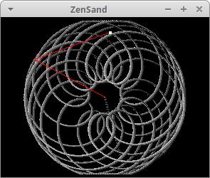

# ZenSand [](https://travis-ci.org/RandomReaper/ZenSand)
## A Bot drawing in sand

The goal is to create a decorative box with a ball drawing in sand.

## Inspirations
* Idea : [hackaday](http://blog.hackaday.com)
* Design : [Bruce Shapiro's Sisyphus](http://www.taomc.com/sisyphus/)
* Mechanics : The [SCARA](https://en.wikipedia.org/wiki/SCARA) arm, mostly the [mini cnc scara plotte](https://youtu.be/XZkR0ZcPujw).
* [Inverse kinematics for scara](https://appliedgo.net/roboticarm/).

## Design choice
Bruce's table are round and I don't have any round table, so I'll limit the movement to a rectangular area.

##Part #1 The simulator


### Give it a try
```bash
git clone https://github.com/RandomReaper/ZenSand.git
cd ZenSand
mvn install exec:java
```
Feel free to resize the window.

